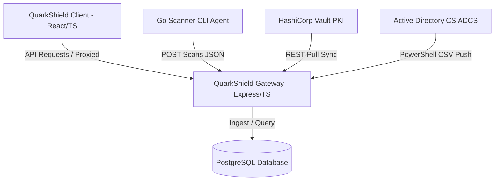

# QuarkShield: Quantum Readiness Assessment Platform
### Enterprise User Process Guide & Operations Manual

QuarkShield is an open-source Quantum Readiness Assessment Platform designed to discover, audit, and plan the migration of legacy cryptographic assets (RSA, ECC, Diffie-Hellman) to Post-Quantum Cryptography (PQC) standards (ML-KEM, ML-DSA, XMSS, LMS) based on NIST, CNSA 2.0, and EO 14028 guidelines.

---

## 1. System Architecture Overview



*   **Frontend Client:** React 19 + TypeScript + Vite, featuring responsive layout dashboards, priority-based timeline builders (Mosca's Theorem), compliance matrices, and interactive AI migration helpers.
*   **Backend Server:** Express + Node.js supporting real-time TLS socket handshakes, CA integration hooks, and PostgreSQL storage adapter.
*   **CLI Crawler Agent:** Compiled Go executable designed to crawl filesystem paths, parse SSH keys/PEM certificate arrays, and POST discoveries back to the central console.
*   **Ingestion Integrations:** Native integration connectors for enterprise Certificate Authorities (HashiCorp Vault PKI & Microsoft Active Directory Certificate Services).

---

## 2. Setup & Installation

### Prerequisites
*   Node.js (v18+) & npm
*   PostgreSQL database (Port `5432`)
*   Go (v1.20+) *[Optional: Only required to compile/run the standalone CLI scanner agent]*

### Docker Compose Production Setup (Unified)
To deploy the entire QuarkShield platform (Frontend React app, Express backend, and PostgreSQL database) on a single self-hosted VPS with a single command:

1.  **Build and launch the services:**
    ```bash
    GEMINI_API_KEY="your_api_key_here" docker-compose up -d --build
    ```
    *(Omit `GEMINI_API_KEY` if you wish to run the platform with the local rules-based fallback engine).*
2.  **Access the Platform:**
    Open your browser and navigate to `http://localhost:5000` (or your VPS IP). The application is served statically from the Express production webserver on port `5000`.

### Local Development Setup (Manual)
If you prefer running the components natively during development:

1.  **Launch a local PostgreSQL Instance:**
    Ensure you have a PostgreSQL database running locally on port `5432` with a database named `quarkshield`.
2.  **Install Frontend Dependencies & Build Client:**
    ```bash
    npm install
    npm run build
    ```
3.  **Install Backend Dependencies & Compile Server:**
    ```bash
    cd server
    npm install
    npm run build
    cd ..
    ```
4.  **Run Development Servers:**
    *   Start the Express Server (listens on `http://localhost:5000`):
        ```bash
        cd server
        npm run dev
        ```
    *   Start the Vite Dev Server (listens on `http://localhost:5173`):
        ```bash
        npm run dev
        ```

---

## 3. Certificate Authority (CA) Integrations

QuarkShield supports both **REST-pull** and **PowerShell-push** synchronization models to audit certificates from enterprise CA servers.

### A. HashiCorp Vault PKI Engine (REST Pull)
The platform pulls certificates directly from Vault's active certificate list endpoint.
1.  Navigate to the **Discovery & Assessment Scanner** tab in the client console.
2.  Select **CA Server Sync**.
3.  Under the **HashiCorp Vault PKI** section, specify:
    *   **Vault URL:** e.g., `http://localhost:8200`
    *   **Access Token:** The `X-Vault-Token` authentication string.
    *   **Mount Path:** Path to the PKI Secrets Engine (defaults to `pki`).
4.  Click **Trigger Pull Sync**. The server fetches certificate serial numbers from `/v1/pki/certs`, crawls details, performs PQC cryptanalysis, and inserts them into the dashboard inventory.

### B. Microsoft Active Directory Certificate Services (ADCS) (Log Push)
Because ADCS does not natively expose modern REST interfaces, QuarkShield provides an automated push exporter script:
1.  Locate the PowerShell script in `server/src/utils/adcs_sync.ps1` (or copy it directly from the **CA Server Sync** tab).
2.  Deploy the script to your Windows ADCS Certification Authority host.
3.  Run the script as an Administrator:
    ```powershell
    .\adcs_sync.ps1 -ServerUrl "http://quarkshield-portal-address:5000"
    ```
4.  **How it Works:** The script runs `certutil -view` to extract active non-expired certificate serials, subject common names, expiration timestamps, public key algorithms, and key sizes. It parses the resulting records and pushes them in a JSON payload to `/api/ca/adcs/sync` on the QuarkShield server.
5.  **Automation:** To run this continuously, register the script inside the **Windows Task Scheduler** to execute every 24 hours.

---

## 4. Standalone CLI Scanner Agent (Go)

For decentralized network scanning, QuarkShield provides a native Go-based CLI crawler.

### Compiling the Scanner
Compile the scanner binary from the repository:
```bash
cd scanner
go build -o quarkshield-scanner main.go auditor.go client.go
```

### Running Scans
Execute the scanner agent by specifying target paths to search:
```bash
./quarkshield-scanner -server "http://localhost:5000" -path "/etc/ssl/certs"
```
*   **Crawling:** The scanner recursively crawls the directory path.
*   **Cryptographic Parsing:** It decodes PEM blocks, reads public key attributes, identifies legacy algorithms (e.g. RSA < 3072, ECC P-256), and marks vulnerabilities.
*   **Reporting:** Assets are transmitted directly to the central dashboard database.

---

## 5. Operational Verification Guidelines

### A. Performing a TLS Endpoint Scan
1.  Go to the **TLS Endpoint Scan** sub-tab in the scanner interface.
2.  Enter any remote domain name (e.g., `https://google.com`).
3.  Click **Scan Endpoint**. The server initiates a TLS handshake connection, audits the server certificate chain, and checks for PQC-compatible key exchange parameters.

### B. Simulating Local Fallback Modes
If running in offline/client-only demonstration environments (without a running PostgreSQL DB or Express server), both **Vault Sync** and **ADCS Sync** features automatically failover to local mock generators. 
*   Clicking **Trigger Pull Sync** or **Simulate Windows Push** will generate realistic PQC cryptographic assets and display compliance audit results in-memory immediately.
