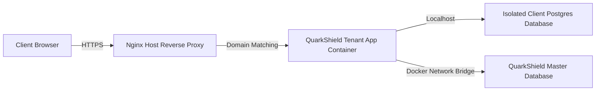

# QuarkShield Crypto CMDB: Technical Specification

This document details the system architecture, metadata query specifications for **Tier 1 (Direct API Discovery)** topics, log ingestion mechanisms for **Other Integrated Sources**, packet capture mechanisms for **Tier 3 (Passive Cryptographic Discovery)**, and database schema designs supporting the QuarkShield Crypto CMDB module.

---

## 🏗️ System Architecture & Multi-Tenancy

QuarkShield operates on a highly secure, physically isolated multi-tenant architecture designed to meet enterprise compliance guidelines:



1. **Isolation Boundary**: Each tenant runs an isolated Docker container stack containing a private database volume (`quarkshield_db_<tenant_name>`) and a separate Web App node.
2. **Replication Syncing**: Configuration updates (such as enabling/disabling the premium CMDB service) are saved in the Master Database and propagated in real-time to the tenant's database using the Docker internal bridge (`host.docker.internal`).
3. **Handshake Security**: Nginx configures key exchange curves at the host reverse proxy level, using modern post-quantum hybrid key encapsulation groups (`X25519MLKEM768:SecP384r1MLKEM1024`) for PQC-supported clients.

---

## 🔌 Tier 1 Direct API Discovery Specifications

**Purpose**: Query cloud service providers, network appliances, and platform orchestrators directly to discover certificates, private keys, cryptographic configurations, and TLS listeners.

### 1. AWS (Amazon Web Services)
Direct API scanning calls the AWS SDK using configured IAM Service Account credentials:
- **AWS ACM (Certificate Manager)**:
  *   *Query*: `ListCertificates` followed by `DescribeCertificate` on each ARN.
  *   *Metadata Extracted*: Public Key algorithm, key size (e.g., RSA-2048, ECDSA-256), certificate chain, validity dates, subject alternative names (SANs).
- **AWS ELB (Elastic Load Balancing)**:
  *   *Query*: `DescribeLoadBalancers` followed by `DescribeListeners` and `DescribeListenerCertificates`.
  *   *Metadata Extracted*: Target ports, attached SSL policies (e.g., `ELBSecurityPolicy-TLS13-1-2-2021-06`), associated ACM certificates.
- **AWS API Gateway**:
  *   *Query*: `GetDomainNames` followed by `GetStages`.
  *   *Metadata Extracted*: Custom domains, security policies (TLS 1.2 vs TLS 1.0), certificate ARNs.
- **AWS IAM**:
  *   *Query*: `ListServerCertificates` and `GetServerCertificate`.
  *   *Metadata Extracted*: Legacy certificates uploaded directly to IAM, expiration status, signature algorithm.
- **AWS Secrets Manager**:
  *   *Query*: `ListSecrets` followed by filtering secrets containing key words like `private_key`, `ssh`, `pem`, `cert`.
  *   *Metadata Extracted*: Storage paths of raw certificates, SSH key pairs, and encryption keys.

---

### 2. Azure (Microsoft Azure)
Queries the Azure Resource Graph and Azure Key Vault REST APIs:
- **Azure Key Vault**:
  *   *Query*: `GET /secrets` and `GET /certificates` on Vault endpoints.
  *   *Metadata Extracted*: Certificate parameters, public keys, active SSL bindings, key lengths.
- **App Service / Application Gateway**:
  *   *Query*: `GET /providers/Microsoft.Network/applicationGateways` and `GET /providers/Microsoft.Web/sites`.
  *   *Metadata Extracted*: SSL profiles, listener certificates, frontend HTTPS configurations.

---

### 3. GCP (Google Cloud Platform)
Calls the Google Cloud Client Library endpoints:
- **GCP Certificate Manager**:
  *   *Query*: `gcloud certificate-manager certificates list`.
  *   *Metadata Extracted*: Mapped domain names, public key size, expiration, self-managed vs Google-managed indicator.
- **Google Cloud Load Balancing (HTTPS/TCP/UDP)**:
  *   *Query*: `gcloud compute target-https-proxies list` and `gcloud compute ssl-policies list`.
  *   *Metadata Extracted*: GCP Load Balancer instances, active listeners, SSL/TLS negotiation policies, minimum TLS version requirements, bound SSL certificates.

---

### 4. Kubernetes
Uses the Kubernetes API client in-cluster or via external config:
- **Kubernetes Secret Store**:
  *   *Query*: `kubectl get secrets --all-namespaces --field-selector type=kubernetes.io/tls`.
  *   *Metadata Extracted*: Base64 certificates stored as secrets, namespace, creation dates.
- **Ingress Controllers (Nginx/Traefik)**:
  *   *Query*: `kubectl get ingress`.
  *   *Metadata Extracted*: Host mapping rules, TLS secret bindings, TLS version parameters.
- **Service Mesh Integration (Istio / Linkerd)**:
  *   *Query*: `kubectl get gateways.networking.istio.io` and `kubectl get peerauthentications.security.istio.io`.
  *   *Metadata Extracted*: Istio Gateway credentials, VirtualServices SSL bindings, Envoy sidecar mutual TLS (mTLS) enforcement and key configurations.

---

### 5. Network Appliances (F5, Palo Alto, Cisco)
Uses direct REST APIs or SSH configuration parses:
- **F5 BIG-IP (Local Traffic Manager)**:
  *   *Query*: `GET /mgmt/tm/ltm/profile/client-ssl` and `GET /mgmt/tm/ltm/virtual`.
  *   *Metadata Extracted*: Client-SSL profile cert/key associations, cipher configuration lists, fallback options. Mapped to active Virtual Servers (VIPs / Virtual IPs) representing frontend endpoints.
- **Palo Alto GlobalProtect & Firewalls**:
  *   *Query*: `GET /api/?type=config&action=show&xpath=/config/shared/ssl-decrypt` and `GET /api/?type=config&action=show&xpath=/config/devices/entry/vsys/entry/profiles/ssl-vpn`.
  *   *Metadata Extracted*: Decryption profiles, local root CA certificates used for SSL decryption inspection, inbound inspection keys, GlobalProtect SSL/IPSec VPN portal and gateway configurations.
- **Cisco ASA**:
  *   *Query*: Parser executing `show run ssl` and `show crypto ca certificates`.
  *   *Metadata Extracted*: Bound trustpoints, certificate key metrics, enabled TLS versions, Remote Access VPN (AnyConnect) endpoints.

---

## 📥 Other Integrated Sources (Logs & Aggregators)

**Purpose**: Ingest log events, audit records, and vulnerability scans from secondary platforms to identify shadow certificates, active handshakes, and asset context mapping.

| Source | Ingestion Mechanism | Purpose / Ingested Metadata |
| :--- | :--- | :--- |
| **Splunk** | HTTP Event Collector (HEC) / Splunk REST API | Extract TLS handshake logs (SNI, negotiated cipher, protocol version) from web server ingress logs. |
| **Microsoft Defender** | Microsoft Graph Security API | Fetch host vulnerability reports indicating outdated SSL/TLS libraries on servers. |
| **CrowdStrike** | CrowdStrike Falcon Event Streams API | Scan endpoints to report stored SSH keys, private certificate files, and vulnerable encryption configs. |
| **Qualys / Tenable** | Vulnerability Scan Ingestion (REST API) | Import network scanning reports highlighting vulnerable SSL endpoints, certificate expiration warnings, and weak cipher lists. |
| **ServiceNow** | ServiceNow Table API (`cmdb_ci_certificate`) | Cross-reference discovered assets with existing enterprise configuration items, updating owners and business services. |
| **Workday / SharePoint** | API Audit Log Ingestion | Monitor access logs to trace secure file delivery exchanges and identify legacy TLS connections. |

---

## 📡 Tier 3 Passive Cryptographic Discovery Specifications

**Purpose**: Passively capture and decode network frame headers to identify active TLS handshakes, SNIs, and cryptographic negotiations without placing active queries on network hosts.

### 1. Ingress Packet Sniffer (Live eth0 Capture)
The passive engine attaches a network listener to `eth0` in promiscuous mode.
- **Filter Constraint**: Compiled BPF (Berkeley Packet Filter) targeting TLS Client/Server Hello handshakes:
  ```text
  tcp port 443 and (tcp[((tcp[12] & 0xf0) >> 2)] = 0x16)
  ```
  *(Captures TLS Handshake Protocol `0x16` over TCP Port 443).*
- **Metadata Parser Execution**:
  1. **TLS ClientHello**:
     *   Reads the *Server Name Indication (SNI)* extension (type `0x0000`) to extract the domain name.
     *   Audits the *Supported Groups* extension (type `0x000a`) to list client-compatible curves.
  2. **TLS ServerHello**:
     *   Audits the *Selected Cipher Suite* byte mapping.
     *   Reads the *Key Share* extension (type `0x0033`) to determine the curve negotiated for key exchange.
- **Quantum Risk Assessment Rules**:
  *   **Post-Quantum Secure**: Negotiated key exchange utilizes hybrid algorithms, such as `X25519MLKEM768` (represented by experimental codepoint `0x6399` or standard curve markers) or `SecP384r1MLKEM1024`.
  *   **Quantum Vulnerable**: Negotiated key exchange utilizes classical elliptic curves (like X25519 or NIST P-256/secp256r1) or falls back to traditional RSA key transport ciphers.

### 2. PCAP Ingestion Ingest Model
Enables administrators to upload Wireshark traces for offline batch analysis:
- **API Endpoint**: `POST /api/scan/passive/pcap`
- **Request Payload**:
  ```json
  {
    "fileName": "sub-ingress-capture.pcap",
    "fileSize": 184320
  }
  ```
- **Response Payload**:
  ```json
  [
    {
      "id": "shadow-pcap-1781226846-1",
      "name": "shadow-ingress-lb.internal",
      "ip": "10.220.14.3",
      "protocol": "TLSv1.3",
      "algorithm": "TLS_AES_128_GCM_SHA256 / RSA-4096",
      "isVulnerable": true,
      "riskLevel": "high",
      "status": "Quantum Vulnerable"
    },
    {
      "id": "shadow-pcap-1781226846-2",
      "name": "pqc-mail-relay.secure",
      "ip": "192.168.12.110",
      "protocol": "TLSv1.3",
      "algorithm": "X25519MLKEM768 / ECDSA",
      "isVulnerable": false,
      "riskLevel": "secure",
      "status": "Post-Quantum Secure"
    }
  ]
  ```

### 3. Active CMDB Ingestion Flow
When an administrator clicks **"Import to CMDB"** on a passively discovered asset:
1. The frontend maps the shadow model to the standard `AuditResult` payload.
2. In order to bind the asset contextually to the core enterprise configuration, the asset description is formatted with structured JSON metadata:
   ```text
   Passively discovered shadow asset |CMDB:{"businessService":"Enterprise Shadow Ingress","application":"Unconfigured Listener","endpoint":"shadow-ingress-lb.internal","owner":"secops-alert@spinovation.com","lifecycle":"Active"}
   ```
3. A `POST /api/assets` request is sent. The parser decodes this string pattern to assign proper relationships and links it inside the **Active Inventory Table** and **SVG Dependency Mapper**.

---

## 🗄️ Database Schema & Ingestion Models

### 1. Master database schema (`users` table)
Tracks client accounts and premium status features.
```sql
CREATE TABLE users (
    id UUID PRIMARY KEY DEFAULT gen_random_uuid(),
    email VARCHAR(255) UNIQUE NOT NULL,
    password_hash VARCHAR(255) NOT NULL,
    salt VARCHAR(255) NOT NULL,
    role VARCHAR(50) DEFAULT 'user',
    email_verified BOOLEAN DEFAULT false,
    cmdb_enabled BOOLEAN DEFAULT false,  -- Controls "Crypto CMDB" premium visibility
    row_locked BOOLEAN DEFAULT false,    -- Prevents row deletion or modification
    last_login TIMESTAMP,
    created_at TIMESTAMP DEFAULT CURRENT_TIMESTAMP
);
```

### 2. Tenant database schema (`assets` table)
Stores the cryptographic assets mapped within the client's isolated console.
```sql
CREATE TABLE assets (
    id VARCHAR(100) PRIMARY KEY,
    type VARCHAR(50) NOT NULL,               -- 'certificate', 'key', 'file', 'url'
    name VARCHAR(255) NOT NULL,             -- Hostname or file name
    algorithm VARCHAR(255) NOT NULL,        -- e.g. RSA-2048, X25519MLKEM768
    key_size INT NOT NULL,                  -- Key size in bits
    hash_algorithm VARCHAR(100),            -- e.g. SHA-256, SHA-384
    is_vulnerable BOOLEAN NOT NULL,         -- True if vulnerable to quantum decrypts
    risk_level VARCHAR(50) NOT NULL,        -- 'critical', 'high', 'medium', 'secure'
    status VARCHAR(100) NOT NULL,           -- 'Quantum Vulnerable' or 'Post-Quantum Secure'
    description TEXT,                       -- Detailed context / CMDB parameters
    recommendation TEXT,                    -- PQC transition recommendations
    explainer TEXT,                         -- Cryptanalysis details
    compliance_violations JSONB,            -- List of violated standards (CNSA, NIST)
    created_at TIMESTAMP DEFAULT CURRENT_TIMESTAMP
);
```

---

## 🚀 Future Roadmap: Tier 4

The ingestion and scanning architecture has been modularly constructed. Future iterations will introduce:
- **Tier 4 (Binary Static Code Analysis)**: Scanning compiled binaries, jar archives, and server filesystem images to extract hardcoded keys, SSH credentials, and embedded cipher libraries.
