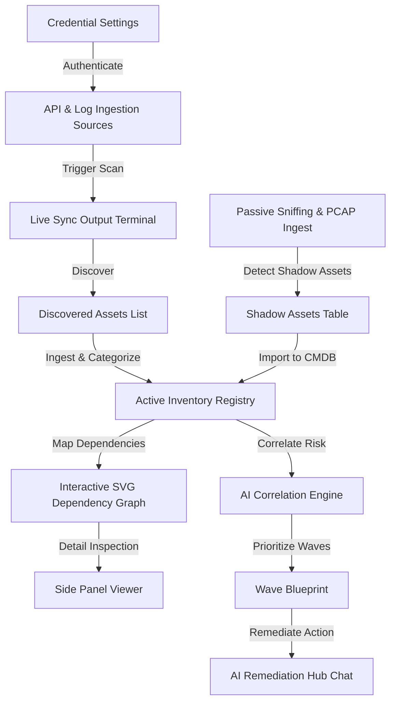

# QuarkShield Crypto CMDB: User Guide

Welcome to the **QuarkShield Crypto CMDB (Cryptographic Configuration Management Database)**. This console acts as your organization’s centralized hub for identifying, mapping, auditing, and transitioning cryptographic assets (such as TLS certificates, keys, and algorithms) in preparation for post-quantum cryptography (PQC) standards.

This guide provides a comprehensive walkthrough of the console's features, step-by-step instructions for standard administrative workflows, and a Frequently Asked Questions (FAQ) section.

---

## 🌟 Key Features Overview

The Crypto CMDB control center is organized into several key operational areas:



### 1. Connection Settings & Credentials Control Panel
Configure access parameters for direct API scanning (e.g., AWS, GCP) and other integrated log sources (e.g., Splunk, ServiceNow). 
- **Authentication Modes**: Toggle between **Service Account** (Client ID & Client Secret) and **Private Key File (PEM)** (uploading or copy-pasting certificate keys).
- **Connection Indicator**: Prepend checkmarks (`✓`) in the source selectors to immediately flag configured, active connections.

### 2. Metadata-First Sync Terminal
A real-time output terminal displaying socket handshake, API query steps, credential validation logs, and asset ingestion results during discovery.

### 3. Active Inventory Table
A permanent registry of cryptographic assets categorized by:
- **Business Service**: The high-level enterprise function (e.g., Transactional Core Payment).
- **Application**: The client software utilizing the cryptography (e.g., PayShield API).
- **Endpoint**: The network entry point (e.g., `api.payments.enterprise.com`).
- **Owner**: The contact email for remediation.
- **Lifecycle Status**: Active, Migrating, or Remediated.

### 4. Interactive SVG Dependency Mapper
A visual graph mapping the upstream business service through the application and endpoint down to the certificate and cipher suite used, using color-coded paths to indicate quantum threats.

### 5. Passive Cryptographic Discovery (Tier 3)
A real-time network sniffer and trace dump importer designed to catch "shadow assets" (untracked systems negotiating cryptography on your network):
- **Live Ingress Terminal**: Displays live TCP/TLS negotiations captured from the network interface `eth0`.
- **Animated Ingest Flow**: Visualizes network packet ingress pathing through the ASN.1 TLS parser down to the CMDB.
- **PCAP Ingest Zone**: Drag-and-drop zone to parse Wireshark capture files (`.pcap` / `.pcapng`).
- **Shadow Assets Registry**: Table listing passively detected cryptographic connections with single-click **Import to CMDB** buttons to log them permanently.

### 6. AI Cryptographic Correlation Engine
An automated intelligence module that parses CMDB posture, evaluates algorithms against federal timelines, and computes dependency risks:
- **Risk Audit Trigger**: Runs deep modeling simulations with progressive progress feedback.
- **Correlated Insights**: Generates structured security cards calling out active structural vulnerabilities.
- **Prioritized Waves Blueprint**: Formulates Wave 1 (Immediate), Wave 2 (High), and Wave 3 (Standard) tables with ownership emails and direct **Remediate** redirection links to the chatbot advisor.

---

## 🛠️ Step-by-Step Usage Guide

### Step 1: Navigating to the Crypto CMDB
1. Log in to the **QuarkShield Console** using your authenticated credentials.
2. Select **Crypto CMDB** from the sidebar navigation menu.
> [!NOTE]
> If the "Crypto CMDB" option is not visible in the sidebar, verify with your platform administrator that the premium CMDB service has been activated for your tenant account.

---

### Step 2: Configuring Connection Credentials
Before triggering a metadata scan, you must authenticate with the target source.
1. Locate the **Direct API Discovery Sources** or **Other Internal Sources** dropdown menu in the CMDB tab.
2. Select the source you want to configure (e.g., **AWS**).
3. Click the **Settings (Gear Icon)** button next to the dropdown.
4. Choose your authentication mode:
   - **Service Account**: Enter the *Client ID* and *Client Secret*.
   - **Private Key File (PEM)**: Click *Browse Files* to select your `.pem` key file, or drag and drop it into the designated zone.
5. Click **Test & Save Configuration**.
6. A success message will appear showing a simulated OAuth Access Token. A checkmark (`✓`) will now appear next to the source in the dropdown.

---

### Step 3: Running a Metadata Scan (Direct Discovery)
1. Select the configured source from the dropdown list.
2. Click the **Trigger Discovery** button.
3. Observe the **Live Sync Output Terminal** as it authenticates using your saved credentials, queries endpoints, and extracts certificate metadata.
4. **Expected Output**:
   ```text
   [CMDB-INIT] Initializing cryptographic sync for source 'AWS'...
   [AUTH] Service account token generated: jwt_324af8e...
   [SCAN] Querying AWS ACM for certificates...
   [SCAN] Querying ELB for active HTTPS listeners...
   [SUCCESS] Metadata sync finished. 1 new asset imported into Crypto CMDB.
   ```

---

### Step 4: Using Passive Cryptographic Discovery (Tier 3)
Passive Discovery helps identify untracked endpoints negotiating security protocols on your local subnets:
1. Navigate to the **Crypto CMDB** tab.
2. Select the **Passive Discovery (Tier 3)** sub-tab at the top of the interface.
2. **Start Live Capture**:
   - Click the **Start Passive Capture** button.
   - The button will pulse red, showing *Stop Passive Capture*, and the animated ingest flow will begin running.
   - The terminal will begin streaming live TCP and TLS handshake logs parsed from the network interface `eth0`.
3. **Analyze Handshakes**:
   - The terminal highlights protocols (`TLSv1.2` vs `TLSv1.3`), SNI headers, and key-shares (curves).
   - If a connection uses classical cryptography (e.g., ECDHE-RSA), the terminal highlights it as **[VULNERABLE]**. Hybrid key shares (e.g. `X25519MLKEM768`) are marked **[PQ-SECURE]**.
4. **Ingest PCAP/Wireshark Dumps**:
   - Locate the **Ingest Wireshark PCAP Capture Files** zone.
   - Drag and drop a `.pcap` or `.pcapng` packet capture file, or click **Browse PCAP Files** to select one.
   - The system displays a progress bar and outputs analysis status logs to the terminal.
   - Once completed, the parsed hosts will be automatically loaded into the **Discovered Shadow Assets** table below.
5. **Import Shadow Assets into Active CMDB**:
   - Review the discovered entries in the **Discovered Shadow Assets** table.
   - Locate an endpoint you wish to register in your permanent inventory and click **Import to CMDB**.
   - The system maps the properties to the standard CMDB schema and saves it. The asset will immediately disappear from the shadow registry and populate in your **Crypto CMDB** inventory.

---

### Step 5: Auditing Discovered Assets & Dependencies
1. Navigate back to the **Crypto CMDB** tab.
2. Scroll to the **CMDB Dependency Registry** table and locate the imported asset.
3. Scroll to the **Interactive SVG Dependency Mapper**. 
4. Select the asset from the list to see its dynamic dependency chain.
   - **Red/Critical Paths**: Classical RSA/ECC algorithms (e.g., RSA-2048, ECDSA-256) that are vulnerable to Shor's algorithm.
   - **Green/Secure Paths**: Post-quantum hybrid curves (e.g., `X25519MLKEM768`) that protect historical sessions from decrypt attacks.

---

### Step 6: Exporting Audit Trails
1. To export raw scanning console logs: Click **Export Audit Trail** above the terminal to download a `.log` text file.
2. To export inventory tables: Click **Export to CSV** above the active inventory table to download a spreadsheet of all mapped assets.

---

### Step 7: Running AI Cryptographic Correlation & Threat Modeling
1. Navigate to the **Crypto CMDB** control center and click the **AI Correlation Engine** sub-tab.
2. Click **Run Correlation Threat Audit**.
3. The engine simulates threat models, displaying progress and real-time validation logs in the terminal console.
4. **Insights Grid**: Review generated security findings highlighting cipher reuse, CNSA 2.0 compliance issues, or weak configuration chains.
5. **Migration Blueprint**:
   - Scroll through prioritized tables representing Wave 1 (Immediate), Wave 2 (High), and Wave 3 (Standard) assets.
   - For any asset, click the **Remediate** action button. The console will automatically redirect you to the **AI Remediation Hub** virtual assistant chat and execute a pre-loaded query detailing specific code snippets and config mitigations for that asset.

---

## ❓ Frequently Asked Questions (FAQ)

### Q1: Does the scan inspect or store our raw network payload data?
**A**: No. The direct API auditor only queries cloud/service APIs for resource metadata (like certificate parameters, expiration, and key sizes) and initiates raw TCP handshakes to audit cipher negotiations. No app payload, user credentials, or database files are ever scanned or transmitted.

### Q2: How do we handle rotation of service accounts?
**A**: Simply open the Connection Settings gear dialog for the source, input the new Client Secret or upload the new PEM file, and click *Test & Save*. The active session token will automatically invalidate and fetch a fresh token using the new credentials during the next scan cycle.

### Q3: How does the CMDB sync with our primary ServiceNow or Jira tools?
**A**: When you run a risk simulation in the **Migration & Impact** panel, you can click *Create ServiceNow Ticket* or *Create Jira Ticket*. The system compiles the metadata schema (business service, owner, endpoint, and remediation script) and generates a structural payload that maps directly to the standard CMDB configurations of those systems.

### Q4: What is the difference between "Direct API" and "Other Internal" sources?
**A**: **Direct API Discovery** queries cloud providers and network endpoints directly for live certificate handshakes. **Other Internal Sources** ingest audit logs, vulnerability scans, and directory logs from existing systems (like Splunk or Tenable) to cross-reference discovered assets.

### Q5: Does passive sniffing (eth0 capture) impact network performance?
**A**: No. The sniffer operates asynchronously on a separate system thread using optimized BPF (Berkeley Packet Filter) kernel rules. It strictly monitors client-to-server TLS negotiations (`ClientHello` and `ServerHello` packets) and discards all other packet types (UDP, ICMP, DNS, TCP payload data) instantly at the network layer.

### Q6: Can we parse PCAP packet capture files generated by Wireshark?
**A**: Yes. Any standard packet capture file formatted as `.pcap` or `.pcapng` containing TCP handshakes over port 443 (HTTPS), 22 (SSH), or 636 (LDAPS) can be dragged and dropped into the upload zone to automatically reconstruct certificates and cryptographic negotiations.

### Q7: How does the AI Correlation Engine prioritize migration waves?
**A**: Prioritization is based on NIST SP 800-219 and CNSA 2.0 timelines. Wave 1 prioritizes critical systems using obsolete asymmetric cryptography (e.g. RSA-1024) or insecure hash functions (MD5, SHA-1). Wave 2 groups standard classical asymmetric configurations (RSA-2048, ECDSA-256) on production endpoints. Wave 3 captures internal systems and services utilizing strong classical symmetric algorithms (AES-128, etc.).

### Q8: What happens when I click the "Remediate" button in a migration wave?
**A**: Clicking "Remediate" logs a context-aware prompt containing the asset name, algorithm, and business service into your local session variables, navigates you to the Virtual Cryptography Advisor chatbot, and submits the prompt automatically. The AI advisor then responds with targeted, quantum-safe code or config snippets tailored to that specific environment.

